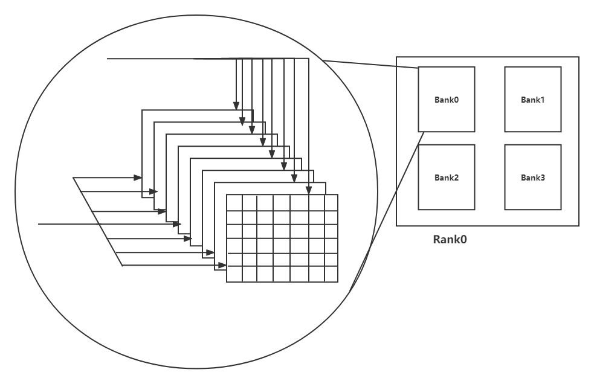

### dram结构
  
&emsp; NEMU中对ddr3进行了模拟,地址一共27位，rank地址4位，bank地址3位，行地址10位，列地址10位，那么内存的空间将一共有128MB的内存。  
&emsp; DRAM的内部，在每一个bank设定了一个行缓冲，每一个行缓冲寄存器，有一个row_id标记当前缓冲器内的行号，还有一个valid用于标记当前缓冲是否被使用。
```
typedef struct{
  uint8_t buf[NR_COL];
  int32_t row_idx;
  bool valid;
} RB; 

一个类的存储用的是uint8_t说明一个bank中有8个存储矩阵，一个列存储8个bit。
```
&emsp;在ddr3开始要确保每个换缓冲中的valid位为false，即没有被使用。  

### dram的读
```
dram的读是一个burst的读，即猝发传送，读地址连续的burst_len个字节，在nemu的模拟中burst_len为8，然而burst的起始地址并不是任意的，它必须是8的整数倍，所以一个burst是读这个区间上的8个字节。

代码如下：
  if(!(rowbufs[rank][bank].valid&&rowbufs[rank][bank].row_idx==row)){
    memcpy(rowsbuf[rank][bank].buf,dram[rank][bank]);
    rowbufs[rank][bank].row_idx = row;
    rowbbufs[rank][banl].valid = true;
  }
  //这里的列地址的第三位为0
  memcpy(data,rowbufs[rank][bank].buf + col,BURST_LEN);
  
  
 dram_read函数要在这个基础上做进一步的抽象，因为dram_read的参数一个是地址，一个读取的长度，长度是个不确定的值。这个地址不一定是8的整数倍，所以可能要分多次读取，在nemu中长度进行限制，无论如何最多四个字节，最多分两个burst读取。
```
### dram的写
```
dram的写相比于读的特殊性在于不经要把写的行读入缓冲进行修改，还要写入bank，最后由于burst的内容不能全写，需要一个掩码mask，指出一个burst长度中需要写的部分。

```


