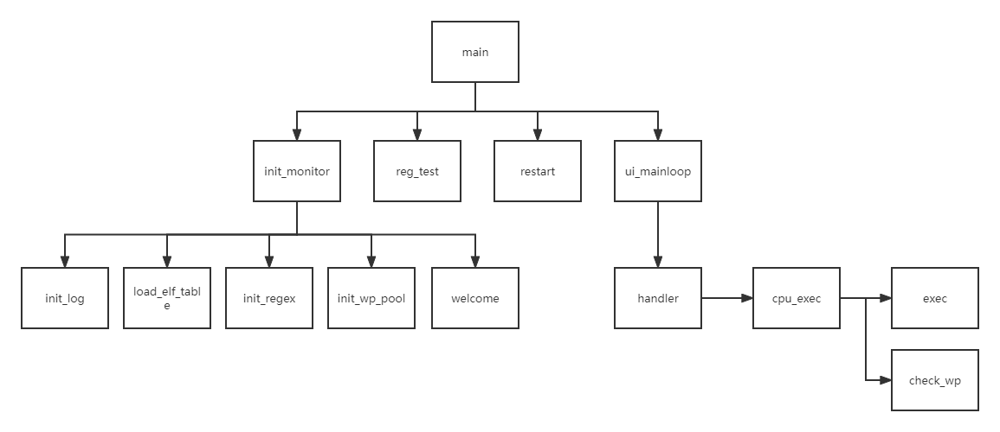
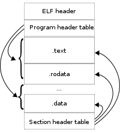

## inti_monitor
1. 其中init_log(...)进行打开log文件的操作
2. load_elf_table(...)进行检查elf头，并且之后再Section table中找到symbol table和string table，找到的方法为遍历Section table找到类型为SHT_SYMTAB和SHT_STRTAB的Section。之后将symbol table和string table读取。这里symbol table和string table的关系为，symbol table中entry中name的值作为再string table中的index可以找到该entry的名字。  

3. init_regex(...)对于debugger中用到表达式需要的正则表达式进行编译，之后可以对生成的token用BNF求值，步骤为先对找到dominant operator，这个是优先级最低的最右符号，当然被括号包围的符号优先级自然就高了。以dominant operator为界用eval左右求值，这里用的是后根遍历，如1  + 4 * (2 + 3) 第一个加号为最低最右的运算符，所以它是dominant operator，当然在碰到')'会主动去匹配'('于是在括号间的符号就不被考虑了。左子树中eval(0,0,success)中left == right则return tokens[0]的值(需要将文字内容转化为number)，右子树中要先去括号，之后2 + 3再递归，最后回溯计算出结果。
4. init_wp_pool 就是初始化head_,free_两个结构，这两个结构是static变量，一个用于管理已经被使用的watchpoint结构体，另一个用于仍然空闲的watchpoint结构体，它们两个的个数之和为32
5. welcome输出欢迎信息
