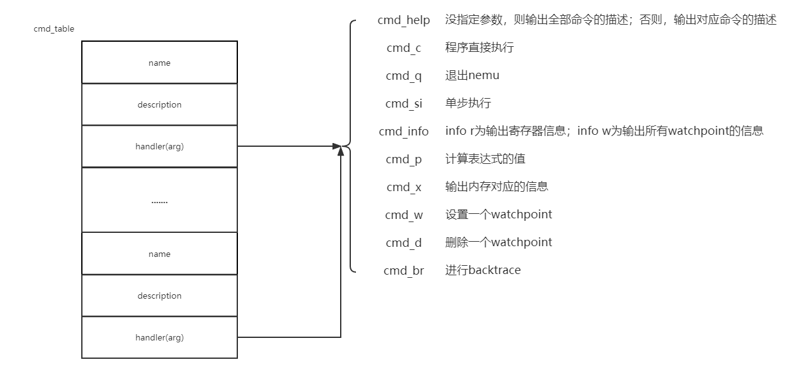

## ui.md
ui_mainloop中是个死循环，不断用readline取命令，之后在cmd_table中进行匹配，最后再执行对应的cmd。

## cpu_exec
```
\\关键部分
 for(;n>0;n--)
 {
    //略
    
    instr_len = exec(cpu.eip);
    cpu.eip += instr_len;
    
    //略
 }
```
