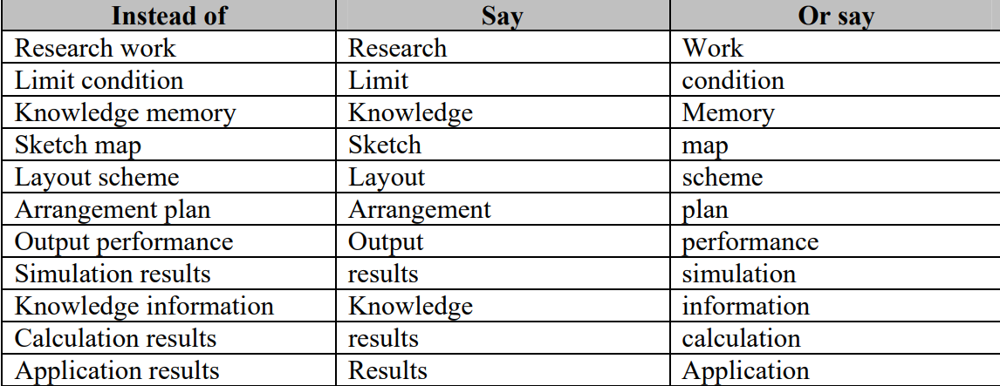

## The Most Common Habits from more than 200 English Papers written by Graduate Chinese Engineering Students
文章讲述了在观察了两百名中国学生写的文章后总结的最常见的写作习惯。为中国理工学生修改论文提供了依据。  
This paper presents some of most common Chinese-English habits observed from over two hundred English technical 
papers by Chinese writers.The habits are explained and in most cases,example text from an actual paper is given
along with preferred text.An attempt is made to explain how to correct and prevent such mistakes.In some cases 
a possible explanation of why the habit occurs is also given.This paper can serve as an individual guide to editing
technical papers especially when a native English-speaking editor is unavailable.

## introduction
毕业写出一篇好的英文论文的要求好像很难完成 。 
Most Chinese universities require their doctoral and master candidates in technical and scientific fields to publish
at least one English paper in an international journal as a degree requirement.However,many factors make this task
difficult to accomplish.
 
## Purpose
介绍中国学生论文中常见的习惯

## Structure
一共有两部分，一部分需要特别注意，这些错误很常见也使得文章难以理解。在第二部分,将给出其他的一些习惯，它们对了解一些细微的差别
很有用。

## Section1
1. “a，an，the”。the most common habit is the omission of articles（冠词）。
  说明：冠词也叫限定词，就是a，an，the，a、an是不定冠词，the是定冠词。在冠词和名词之间的任何修饰都指向这个名词
  限定词，一个词或者词组，传统上被界定为一个形容词，用来说明一个名词的多少。它们用于形容这个名词是通常或者特定的。
  the是一个定冠词，放在名词前用于指定一个已知的事物。a、an是冠词用于说明一个名词不是特定。
2. Very long sentences are especially common in Chinese-English writing because the writers often translate directly
   from Chinese to English.Long sentences can be avoided by limiting each sentence to one or two topics. 
   解决办法：尽量少用从句进行多个语句的连接，用被动语态或者分词进行一个补充修饰，最多加一个连接词进行进一步的说明。  
   另外一种过长的语句就是在一句话里进行了过多的罗列。
3. 通过先陈述目的、位置或者原因来说明句子的主旨。  
   解决办法：先说明句子的主旨，之后再进行补充。例子we create a new machine to solve the problem 而不是to solve ...
4. 倾向于在句子的开头放置说明时间的短语
   解决办法放在句子后面
5. 把最重要的主语放在句首用来强调
   解决办法：一个句子中一个事物被论文中提出的方法解决，将方法作为事物的定语，而不是单独作为一个从句
6. which/that
   所指代的先行词不明显，造成混淆。将which直接放在指定的词后
7. ‘respectively’ and ‘respective’  
   respectively放在句子后用于表达两个列表的关系对应，如果这种关系在前面已经暗示过，则不需要重复说明。
8. ‘in this paper’，‘in this study’  
   the first is overuse，这种表达最好只用在introduction和conclusion中用于强调文章的内容，或者在文章主体中说明这篇文章没完成的工作。可以用用in this research，this paper present 
   另外一个问题就是，‘study’ 意味着作者做的工作，‘paper’意味着读者读的文章，工作的呈现方式，不要用混淆。
9. Numbers and Equation  
   阿拉伯数字不应该用在句子的开头，不是在句子中间不要用符号代替词汇。  
10. format  
   paragraph，不同idea的内容记得分段，段前要有缩进，同时不缩进时记得再空一行  
   Figure and table，Fig. 和 Tbl.是它们的缩写，接的它们的表达全文要统一，还有开头不缩写  
   variables，变量记得缩写和文本相区别  
   Captials，文章中间不要用标题
11. ‘such as’ and ’etc‘  
   such as，etc不用一起用，such as后不要加and
## Section2
1. 注意单复数同形的情况，如literature、equipment、staff、faculty
2. 不要冗余地使用词汇，如下表所示：

3. different、various等词后默认是复数
4. 永远不要开头缩写
5. don’t use ‘by this way’. Instead write ‘by doing this’
6. 不要在句子开头写How to
7. Do write ' the results are shown in Figure 2' . Don't write ' the results are showed as Figure 2'
8. 文章中变量一定要斜体
9. 不要凑字数，写出obviously，not at least to say之类的表达
10. 不要使用aboard，our counrty，因为论文是全世界的人看
11. 尽量将意思在一句话表达清楚。而不是用this is to say延申到下一句话
12. 不要在句子最后加too，尤其是技术类文章
    
   
